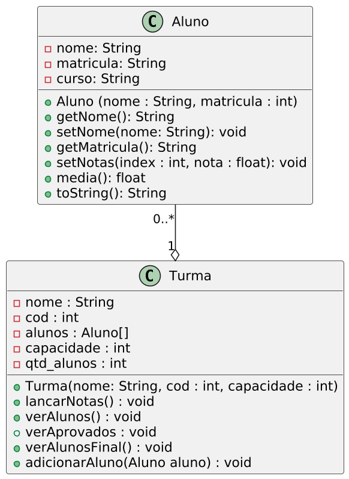

# Turma que Gerencia Alunos

## Introdução

O objetivo desta atividade é implementar uma turma que receba um número específico de alunos, permitindo a adição de alunos e notas, bem como a visualização dos aprovados e dos alunos em recuperação.

### Descrição

- **Aluno**
  - O aluno possui um nome, uma matrícula e um vetor de notas.
  - Ao criar um aluno, são passados para o construtor o nome e a matrícula.
  - Os métodos da classe `Aluno` serão:
    - `getNome`: retorna o nome do aluno.
    - `getMat`: retorna a matrícula do aluno (chamado de `mat` no código).
    - `media`: calcula e retorna a média das notas.
    - `setNotas`: recebe uma posição de índice e uma nota e armazena no vetor de notas.
    - `toString`: imprime o nome, a matrícula, as notas e a média do aluno no formato especificado.
  
- **Turma**
  - A turma possui uma disciplina, um código (`cod`), um vetor de alunos e a quantidade de alunos (`qtd_alunos`).
  - Ao criar a turma, são passados a disciplina, o código e a capacidade de alunos.
  - Os métodos da classe `Turma` serão:
    - `verAlunos`: imprime todos os alunos da turma.
    - `verAprovados`: imprime apenas os alunos aprovados.
    - `verAlunosFinal`: imprime apenas os alunos em recuperação (média entre 4 e 7).
    - `lancarNotas`: solicita duas notas para cada aluno e as atualiza no vetor de notas usando `setNotas`.
    - `adicionarAluno`: recebe uma instância de `Aluno` e a adiciona ao vetor, respeitando a capacidade definida.

## Guia

### Parte 1: Aluno

- Crie uma classe chamada `Aluno` com os atributos `String nome`, `int mat` e `float[] notas`.
- No construtor, receba `String nome` e `int mat`, e inicialize `notas` com tamanho 2.

### Parte 2: Métodos da Classe Aluno

- Crie o método `String getNome()` que retorna o `nome`.
- Crie o método `int getMat()` que retorna a `matricula`.
- Crie o método `float media()` que calcula a média dos valores no vetor `notas`.
- Crie o método `void setNotas(int index, float nota)` que insere uma nota no vetor `notas` de acordo com o índice (verifique se o índice está dentro do tamanho do vetor).
- Crie o método `toString()` que retorna as informações no seguinte formato: `Aluno: {nome}, Matrícula: {mat}, Notas: [{notas[0]}, {notas[1]}], Média: {media()}`.

### Parte 3: Turma

- Crie uma classe chamada `Turma` com os atributos `String disciplina`, `int cod`, `Aluno[] alunos`, `int capacidade` e `int qtd_alunos`.
- No construtor, receba `String disciplina`, `int cod`, `int capacidade`, inicialize `alunos[]` com `capacidade`, e defina `qtd_alunos` como 0.

### Parte 4: Métodos da Classe Turma

- Crie o método `void verAlunos()` que imprime todos os alunos da turma.
- Crie o método `void verAprovados()` que imprime apenas os alunos aprovados (média maior ou igual a 7).
- Crie o método `void verAlunosFinal()` que imprime apenas os alunos de recuperação (média entre 4 e 7).
- Crie o método `void lancarNotas()` que realiza a leitura das duas notas para cada aluno dentro do próprio método. Para cada lançamento, mostre o nome do aluno, solicitando a primeira e a segunda nota individualmente. Em seguida, armazene cada nota usando o método `setNotas` para atualizar o vetor de notas do aluno.
- Crie o método `void adicionarAluno(Aluno aluno)` que recebe uma instância de `Aluno` e a adiciona ao vetor de alunos, respeitando a capacidade definida.
- Lembre-se, nos métodos que imprimem os alunos, de verificar se o aluno não é `null` antes de imprimir.
