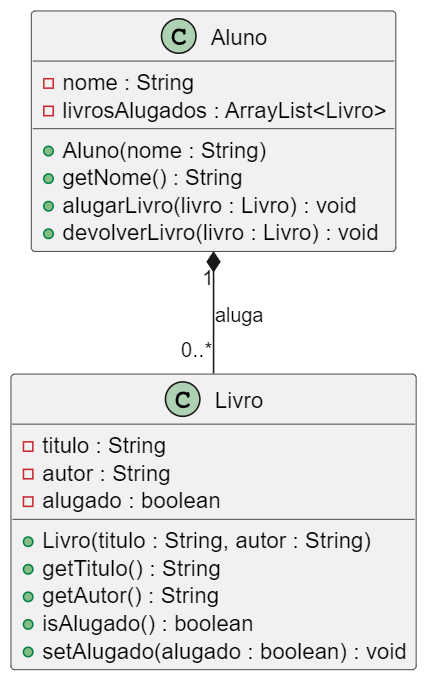

# Aluguel de livros

O objeito desta atividade é implementar um sistema de biblioteca para gerenciar os aluguéis de livros, permitindo que os alunos visualizem quais livros estão disponíveis,alugem os livros que estiverem disponíveis, listem os livros alugados e façam devolução. Para fins práticos, haverá apenas um exemplar de cada título

## Descrição

### 1. Classe `Livro`

Esta classe representa os livros disponíveis para aluguel. Deve incluir:

- **Atributos privados**:
  - `String titulo`: título do livro.
  - `String autor`: nome do autor.
  - `boolean alugado`: indica se o livro está alugado.
- **Métodos públicos**:
  - Um construtor para inicializar os atributos.
  - `getTitulo()`: retorna o título do livro.
  - `getAutor()`: retorna o nome do autor.
  - `isAlugado()`: retorna o status de aluguel do livro.
  - `setAlugado(boolean alugado)`: atualiza o status de aluguel do livro.

---

### 2. Classe `Aluno`

Esta classe representa os alunos que podem alugar livros. Deve incluir:

- **Atributos privados**:
  - `String nome`: nome do aluno.
  - `ArrayList<Livro> livrosAlugados`: lista de livros que o aluno alugou.
- **Métodos públicos**:
  - Um construtor para inicializar o nome do aluno.
  - `getNome()`: retorna o nome do aluno.
  - `alugarLivro(Livro livro)`: adiciona um livro à lista de livros alugados, verificando se o livro já está alugado.
  - `devolverLivro(Livro livro)`: remove um livro da lista de livros alugados e atualiza o status de aluguel.

## Diagrama

