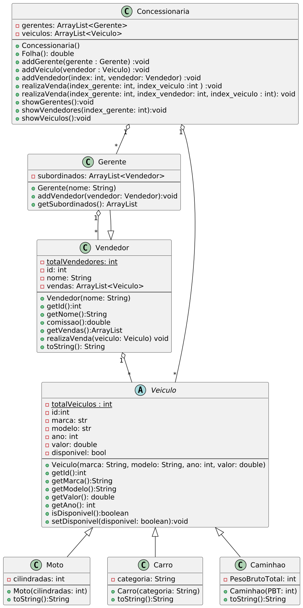

# Gerenciando a Concessionária de Veículos

<!-- toch -->
[Intro](#intro) | [Guide](#guide) | [Shell](#shell)
-- | -- | --
<!-- toch -->

## Intro

O sistema de gerenciamento de concessionária é responsável por gerenciar a venda de veículos, registrando os gerentes, vendedores e veículos disponíveis, além de calcular a comissão dos vendedores e gerentes.

- Você deve utilizar herança para construir um sistema para gerenciar uma concessionária de veículos, incluindo carros, motos e caminhões.

### classe `Veiculo`

- **Atributos**:
  - static `int` totalVeiculos que servirá para incrementar o id de veículos
  - `int` id
  - `String` marca
  - `String` modelo
  - `int` ano
  - `double` valor
  - `boolean` disponivel
- **Métodos**
  - construtor que recebe `marca`, `modelo`,`ano`, `valor`
    O `id` recebe o valor de `totalVeiculos`, `disponivel` recebe `true` e `totalVeiculos` é incrementado
  - get para todos os atributos `id`, `marca`, `modelo`,`ano`, `valor`, `disponivel`

### Classe `Moto`

- **Atributos**:
  - `int` cilindradas
- **Métodos**:
  - Construtor recebendo `cilindradas`
  - String `toString()` retorna uma String na seguinte formatação `Moto[{marca}, {modelo}, {ano}, R${valor}, {cilindradas}cc]`

### Classe`Carro`

- **Atributos**:
  - `String` categoria
- **Métodos**:
  - Construtor recebendo `categoria`
  - `String` toString() retorna uma String na seguinte formatação `Carro[{marca}, {modelo}, {ano}, R${valor}, {categoria}]`

### Classe `Caminhao`

- **Atributos**:
  - `int` pesoBrutoTotal
- **Métodos**:
- Construtor recebendo `pesoBrutoTotal`
  - String `toString()` retorna uma String na seguinte formatação `Caminhao[{marca}, {modelo}, {ano}, R${valor}, {pesoBrutoTotal}kg]`

### Classe `Vendedor`

- A classe `Vendedor` é responsável por realizar vendas de veículos e calcular a comissão.
- **Atributos**:
  - static `int` totalVendedores totalVendedores que servirá para incrementar o `id`
  - `String` nome
  - `ArrayList<Veiculo>` vendas
- **Métodos**:
  - Construtor recebendo `nome`
    `id` receberá o valor de `totalVendedores`, incrementar `totalVendedores` e inicializar `vendas`
  - get para `id`, `nome` e `vendas`
  - método `comissao()` que retorna um `double` com a soma de 10% dos valores dos veículos do ArrayList `vendas`
  - método `realizaVenda(Veiculo veiculo)`
    Recebe um veículo, verifica se está disponível, caso sim, adiciona em `vendas` e modifica o atributo `disponivel` de veiculo para `false`
  - método `toString()` formata as informções do vendedor da seguinte forma:

  Vendedor nome=`{nome}`, id=`{id}`, Comissao=`{comissao}` <br>
  vendas:<br>
  Caminhao[scania, r440, 2020, R$600000.0, 44000Kg]<br>

### Classe `Gerente`

- A classe `Gerente` herda de `Vendedor` e possui vendedores subordinados.

- **Atributos**:
  - `ArrayList<Vendedor>` subordinados

-**Métodos**:

- Construtor recebe `nome` e inicializa a lista `subordinados`
- `addVendedor(Vendedor vendedor)` recebe um vendedor e insere na lista `subordinados`
- `getSubordinados()` retorna a lista de vendedores `subordinados`
- `toString()` sobrescrita do método, adicionando os nomes de seus subordinados

### Classe `Concessionaria`

- **Atributos**:
  - `ArrayList<Gerente>` gerentes armazena os gerentes
  - `ArrayList<Veiculo>` veiculos armazena os veiculos
- **Método**:
  - Construtor padrão que inicializa as listas `gerentes` e `vendedores`
  - `addGerente(Gerente gerente)` recebe um gerente e adiciona em `gerentes`
  - `addVeiculo(Veiculo Veiculo)` recebe um veiculo e adiciona em `veiculos`
  - `addVendedor(int index, Vendedor vendedor)` recebe o índice do gerente e um vendedor, adiciona o vendedor em `subordinados`
  - `realizaVenda(int index_gerente, int index_veiculo)` recebe o índice do gerente e um veículo, adicona o veículo na lista de `vendas` do gerente chamando o método `realizaVenda(Veiculo)`
  - `realizaVenda(int index_gerente, int index_vendedor, Veiculo veiculo)` recebe o índice do gerente e o índice do vendedor, adiciona veículo em `vendas` com o método `realizaVenda(Veiculo)` de `vendedor`
  - `showGerentes()` imprime as informações(toString()) de todos os gerentes
  - `showVeiculo()` imprime as informações(toString()) de todos os veiculos que estão disponíveis
  - `showVendedores(int index)` imprime todos os vendedores de um `gerente`

### Responsabilidades

- **Registrar Veículos:**
  - O sistema deve permitir que novos veículos sejam adicionados à concessionária, registrando a marca, modelo, ano, valor e tipo de veículo.

- **Registrar Vendedores e Gerentes:**
  - O sistema deve permitir que novos vendedores e gerentes sejam adicionados à concessionária, registrando seus nomes e identificadores.
  - Gerentes podem ter vendedores subordinados.

- **Realizar Vendas:**
  - O sistema deve permitir que vendedores realizem vendas de veículos, registrando a venda e marcando o veículo como indisponível.
  - O sistema deve calcular a comissão dos vendedores e gerentes com base nas vendas realizadas.

- **Calcular Comissão:**
  - A comissão dos vendedores é calculada como 10% do valor dos veículos vendidos.
  - A comissão dos gerentes é calculada como 10% do valor das vendas dos seus subordinados, além da sua própria comissão.

- **Obter Lista de Veículos Disponíveis:**
  - O sistema deve ser capaz de fornecer uma lista de todos os veículos atualmente disponíveis na concessionária.

## Guide



Você pode alterar a saída herdada de `toString()` de vendedor para modificar o nome de Vendedor para Gerente manipulando String.

```java
    String replace = super.toString();
    StringBuilder sb = new StringBuilder(replace.replace("Vendedor", "Gerente"));
```

## Shell

```shell
#TESTE_CASE inserindo veiculos
$addMoto honda cg 2020 10000 150 
$addCarro bmw 320i 2020 200000 sport
$addCaminhao volvo fh 2020 500000 50000
$end

#TESTE_CASE mostrando veiculos
$addMoto honda cg 2020 10000 150 
$addCarro bmw 320i 2020 200000 sport
$addCaminhao volvo fh 2020 500000 50000
$showVeiculos
Moto[honda, cg, 2020, R$10000.0, 150cc]
Carro[bmw, 320i, 2020, R$200000.0, sport]
Caminhao[volvo, fh, 2020, R$500000.0, 50000Kg]
$end
#TEST_CASE inserindo gerentes
$addGerente joao
$addGerente maria
$end

#TEST_CASE mostrando gerentes
$addGerente joao
$addGerente maria
$showGerentes
Gerente nome=joao, id=0, Comissao=0.0
vendas:
Subordinados:

Gerente nome=maria, id=1, Comissao=0.0
vendas:
Subordinados:

$end

#TEST_CASE inserindo vendedores
$addGerente joao
$addVendedor 0 pedro
$addVendedor 0 marcos
$showGerentes
Gerente nome=joao, id=0, Comissao=0.0
vendas:
Subordinados:
pedro
marcos

$end

#TEST_CASE mostrando vendedores
$addGerente joao
$addVendedor 0 pedro
$addVendedor 0 marcos
$showVendedores 0
Vendedor nome=pedro, id=1, Comissao=0.0
vendas:

Vendedor nome=marcos, id=2, Comissao=0.0
vendas:

$end

#TEST_CASE realizando venda gerente
$addGerente joao
$addCarro bmw 320i 2020 200000 sport
$realizarVenda 0 0
$end

#TEST_CASE realizando venda vendedor
$addGerente joao
$addVendedor 0 pedro
$addCarro bmw 320i 2020 200000 sport
$realizarVenda 0 0 0
$end

#TEST_CASE mostrando veiculos disponiveis
$addMoto honda cg 2020 10000 150
$addCarro bmw 320i 2020 200000 sport
$addCaminhao volvo fh 2020 500000 50000
$addGerente joao
$addVendedor 0 pedro
$addVendedor 0 marcos
$realizarVenda 0 0 0
$showVeiculos
Carro[bmw, 320i, 2020, R$200000.0, sport]
Caminhao[volvo, fh, 2020, R$500000.0, 50000Kg]
$end

#TEST_CASE calculando folha de pagamento
$addGerente joao
$addVendedor 0 pedro
$addVendedor 0 marcos
$addGerente maria
$addVendedor 1 joana
$addVendedor 1 julia
$addGerente jose
$addVendedor 2 jonas
$addVendedor 2 marcio
$addMoto honda cg 2020 10000 150
$addCarro bmw 320i 2020 200000 sport
$addCaminhao volvo fh 2020 500000 50000
$addMoto yamaha xtz 2020 15000 250
$addCarro audi a3 2020 180000 sport
$addCaminhao scania r440 2020 600000 44000
$addMoto suzuki vstrom 2020 12000 100
$addCarro toyota hilux 2020 150000 offroad
$addCaminhao mercedes actros 2020 700000 60000
$realizarVenda 0 0
$realizarVenda 0 0 1
$realizarVenda 0 0 2
$realizarVenda 1 3
$realizarVenda 1 0 4
$realizarVenda 1 1 5
$realizarVenda 2 6
$realizarVenda 2 0 7
$realizarVenda 2 1 8
$folha
Total em comissoes: 260000.0
$end


#TEST_CASE comissao gerentes
$addGerente joao
$addVendedor 0 pedro
$addVendedor 0 marcos
$addGerente maria
$addVendedor 1 joana
$addVendedor 1 julia
$addGerente jose
$addVendedor 2 jonas
$addVendedor 2 marcio
$addMoto honda cg 2020 10000 150
$addCarro bmw 320i 2020 200000 sport
$addCaminhao volvo fh 2020 500000 50000
$addMoto yamaha xtz 2020 15000 250
$addCarro audi a3 2020 180000 sport
$addCaminhao scania r440 2020 600000 44000
$addMoto suzuki vstrom 2020 12000 100
$addCarro toyota hilux 2020 150000 offroad
$addCaminhao mercedes actros 2020 700000 60000
$realizarVenda 0 0
$realizarVenda 0 0 1
$realizarVenda 0 0 2
$realizarVenda 1 3
$realizarVenda 1 0 4
$realizarVenda 1 1 5
$realizarVenda 2 6
$realizarVenda 2 0 7
$realizarVenda 2 1 8
$folha
Total em comissoes: 260000.0
$showGerentes
Gerente nome=joao, id=0, Comissao=8000.0
vendas:
Moto[honda, cg, 2020, R$10000.0, 150cc]
Subordinados:
pedro
marcos

Gerente nome=maria, id=3, Comissao=9300.0
vendas:
Moto[yamaha, xtz, 2020, R$15000.0, 250cc]
Subordinados:
joana
julia

Gerente nome=jose, id=6, Comissao=9700.0
vendas:
Moto[suzuki, vstrom, 2020, R$12000.0, 100cc]
Subordinados:
jonas
marcio

$end

#TESTE_CASE comissao vendedores
$addGerente joao
$addVendedor 0 pedro
$addVendedor 0 marcos
$addGerente maria
$addVendedor 1 joana
$addVendedor 1 julia
$addGerente jose
$addVendedor 2 jonas
$addVendedor 2 marcio
$addMoto honda cg 2020 10000 150
$addCarro bmw 320i 2020 200000 sport
$addCaminhao volvo fh 2020 500000 50000
$addMoto yamaha xtz 2020 15000 250
$addCarro audi a3 2020 180000 sport
$addCaminhao scania r440 2020 600000 44000
$addMoto suzuki vstrom 2020 12000 100
$addCarro toyota hilux 2020 150000 offroad
$addCaminhao mercedes actros 2020 700000 60000
$realizarVenda 0 0
$realizarVenda 0 0 1
$realizarVenda 0 0 2
$realizarVenda 1 3
$realizarVenda 1 0 4
$realizarVenda 1 1 5
$realizarVenda 2 6
$realizarVenda 2 0 7
$realizarVenda 2 1 8
$folha
Total em comissoes: 260000.0
$showVendedores 0
Vendedor nome=pedro, id=1, Comissao=70000.0
vendas:
Carro[bmw, 320i, 2020, R$200000.0, sport]
Caminhao[volvo, fh, 2020, R$500000.0, 50000Kg]

Vendedor nome=marcos, id=2, Comissao=0.0
vendas:

$showVendedores 1
Vendedor nome=joana, id=4, Comissao=18000.0
vendas:
Carro[audi, a3, 2020, R$180000.0, sport]

Vendedor nome=julia, id=5, Comissao=60000.0
vendas:
Caminhao[scania, r440, 2020, R$600000.0, 44000Kg]

$showVendedores 2
Vendedor nome=jonas, id=7, Comissao=15000.0
vendas:
Carro[toyota, hilux, 2020, R$150000.0, offroad]

Vendedor nome=marcio, id=8, Comissao=70000.0
vendas:
Caminhao[mercedes, actros, 2020, R$700000.0, 60000Kg]

$end

